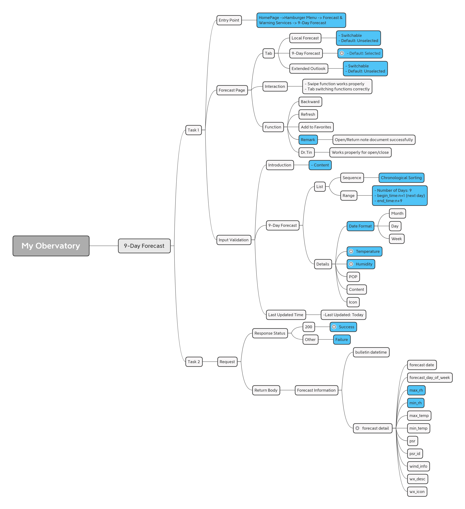

# Setup Guide

## Introduction

A script to get 9 day weather forecast data from MyObservatory app on iOS.

**Review of my work:**   [Review](docs/review.md)
  
**Script of Task 1:**    [UITest](tests/test_weather_forecast.py)
  
**Script of task 2:**    [APITest](apitest.py)

## Get Started
1. Appium (including WebDriverAgent)
2. Xcode
3. Python
4. Any packet capture (like Fiddler)
5. Postman (optional)

## Explore
### Test cases

The cases with asterisks are P0 scenarios, and the darker parts are covered.

### Usage Instructions
   
#### Task 1 - UI Automation Test

  
1. Set up the environment:
  - Install Xcode, Homebrew, Node.js, Python(including  Appium-Python-Client), Appium and Appium-Doctor
2. Prepare the iOS device:
  - Enable Developer Mode and certificates to build succeed
3. Prepare your iOS app:
  - Have the .app file or build the app from source
4. Start Appium server:
  - Open terminal and run 'appium'
5. Run the Python script:
  - Execute your Python script to run the tests on the connected iOS device
6. Analyze results:
  - Check the console output for test results and any errors

#### Task 2 - API Test
1. Set up the environment:
  - Install Python(including  BeautifulSoup)
  - Pycharm (optional)
2. Run the Python script
