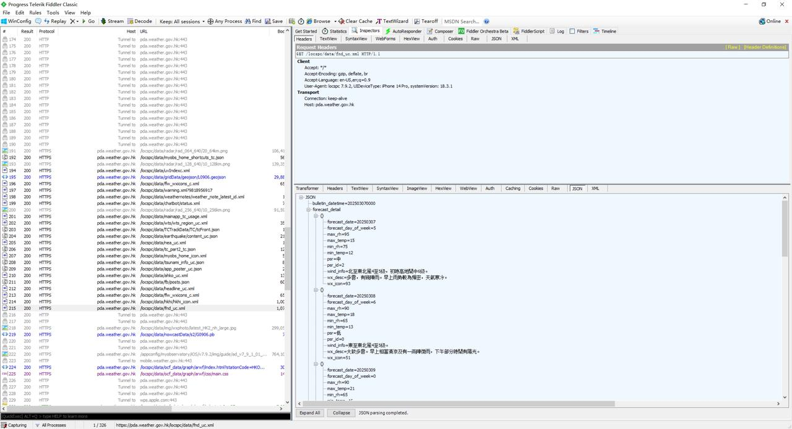

### Review of Task 1

**Time spent:** 1.2D
- Setup Appium Environment - 0.3D
- Test cases and priority- 0.1D
- Write scripts and debug - 0.6D
- Paper work and publishing project to Github - 0.2D

**Steps:**
1. Installation
2. Script and debug
3. Analyze the results

### Review of Task 2 

**Time spent:** 0.1D

**Steps:**
1. Preparation:
- Confirm whether there is an official API 
- Inspect and confirm whether the packet capture can capture original requests from the MyObservatory app
2. Use Fiddler to capture the URL and query params

3. Script to get details
